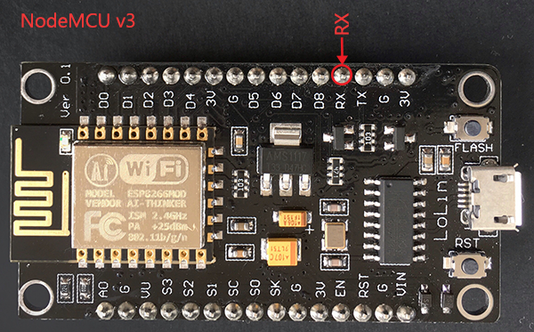
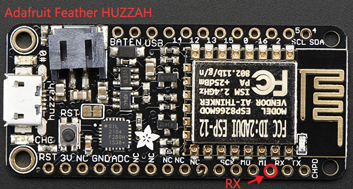
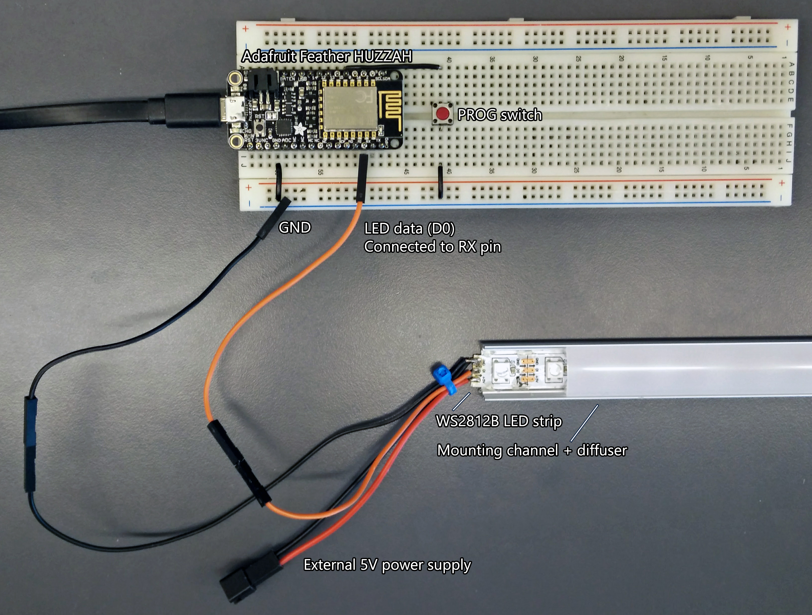

# esp8266_ws2812_i2s
ESP8266 Library for driving WS2812 led-strip using the I2S output. Use within the Arduino IDE.

# Fade In/Out Example
```arduino
#include <ws2812_i2s.h>

#define NUM_LEDS 100

static WS2812 ledstrip;
static Pixel_t pixels[NUM_LEDS];

void setup() 
{
  ledstrip.init(NUM_LEDS);
}

void loop() 
{
  uint8_t i;
  static uint8_t c = 0;
  static uint8_t d = 1;

  for(i=0; i<NUM_LEDS; i++)
  {
    pixels[i].R = c;
    pixels[i].G = c;
    pixels[i].B = c;
  }

  c += d;
  if ( (c==255) || (c==0) ) d = -d;

  ledstrip.show(pixels);
  delay(10);
}
```

# Configuration
This library performs temporal dithering and gamma correction to improve the color depth. See the [FastLED page on temporal dithering](https://github.com/FastLED/FastLED/wiki/FastLED-Temporal-Dithering) for more information.

Temporal dithering can cause noticeable flickering at low brightness levels when driving a large number of LEDs. If you notice flickering, try reducing the amount temporal dithering.

To change the amount of temporal dithering, edit `WS2812_DITHER_NUM` in [ws2812.h](include/ws2812.h). Disabling gamma correction is currently not supported.

# Hardware Connections
The ESP8266 has hardware support for [I²S](https://en.wikipedia.org/wiki/I%C2%B2S) which this library uses to drive ws2812 LED strips.

The data wire of the led-strip (often labelled DIN or D0) should be connected to: `D9 / GPIO3 / RXD0`.

**Note:** In most ESP8266 modules, the RXD0 pin is used when flashing firmware. It is a good idea to disconnect the LED strip from the RXD0 pin before uploading firmware.

For the NodeMCU v3 and Adafruit Feather HUZZAH, the location of the RXD0 pin is shown in the images below. These are just two examples, many other modules also expose the RXD0 pin.




An example configuration using the FeatherHUZZAH is shown below

